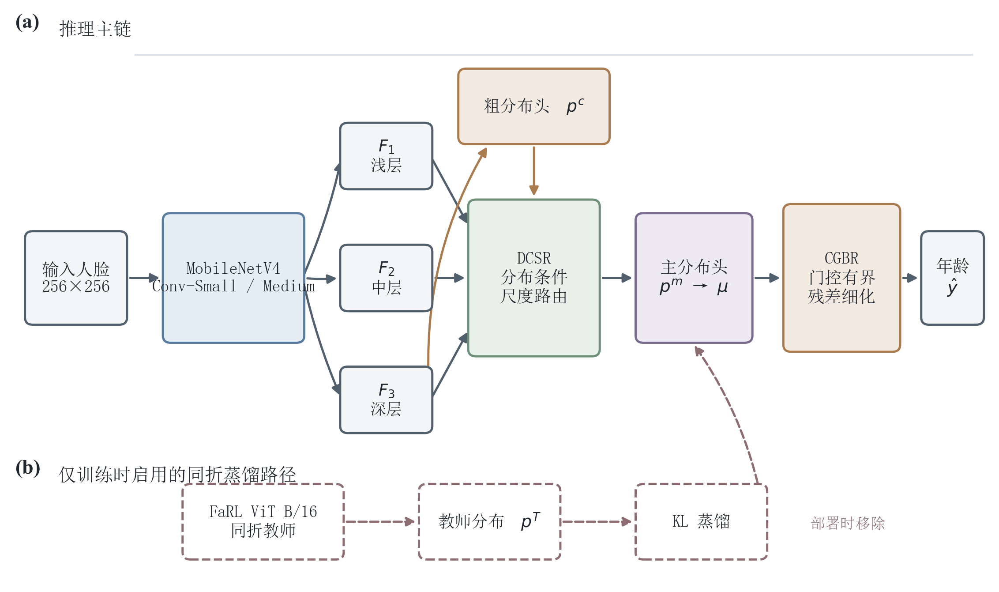
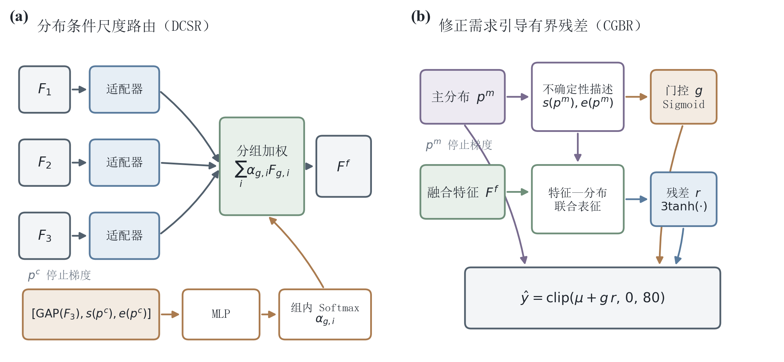
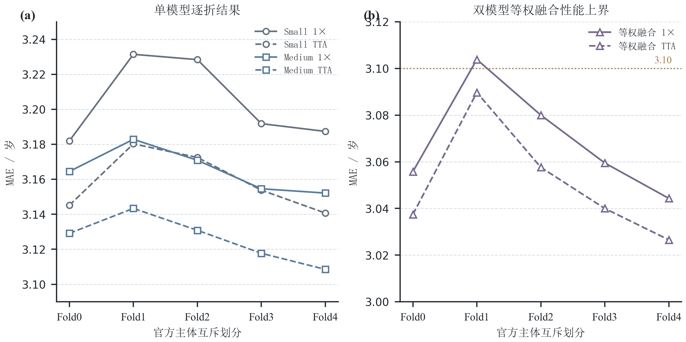

# 基于分布条件尺度路由与有界残差细化的轻量级人脸年龄估计

## Lightweight Facial Age Estimation via Distribution-Conditioned Scale Routing and Bounded Residual Refinement

### 摘要

针对轻量级人脸年龄估计中固定多尺度融合难以响应样本级预测状态、无约束残差易引起过度校正的问题，提出反馈感知分布估计网络 FADE-Net。该网络以 MobileNetV4-Conv 为骨干，由深层特征产生粗年龄分布；分布条件尺度路由模块（distribution-conditioned scale routing，DCSR）联合分布统计、紧凑分布嵌入与深层视觉特征，对三层特征进行分组自适应融合；修正需求引导有界残差模块（correction-need guided bounded residual refinement，CGBR）再依据主分布状态门控幅值不超过 3 岁的残差。训练阶段使用同一主体互斥划分内独立训练的 FaRL 教师进行分布蒸馏，推理阶段移除教师。在 CVPR 2024 公布的 AFAD 五个主体互斥划分、共 165 501 张 15～72 岁人脸图像上，FADE-Net-Medium 的单视图测试 MAE 为 3.1650±0.0112 岁，验证集预选测试时增强后的 MAE 为 3.1259±0.0119 岁；其参数量和计算量分别为 7.525 M 和 1.114 G MACs。FADE-Net-Small 仅含 1.576 M 参数和 0.268 G MACs，单视图 MAE 为 3.2042±0.0212 岁。Medium 在五个划分上均优于 Small，逐折差值为 0.0175～0.0575 岁；DCSR 与 CGBR 合计仅引入 49 882 个参数。由同折 Small 与 Medium 主分布等权融合所得的双模型性能上界为 3.0503±0.0221 岁。结果表明，FADE-Net 在所述协议下形成了具有竞争力的精度—成本折中；多视图与多模型结果应与单模型部署结果分开报告。

关键词：人脸年龄估计；标签分布学习；多尺度特征融合；知识蒸馏；轻量网络

### Abstract

To address fixed multi-scale fusion and potentially excessive residual correction in lightweight facial age estimation, this paper proposes FADE-Net, a feedback-aware distribution estimation network. A MobileNetV4-Conv backbone first produces a coarse age distribution. Distribution-conditioned scale routing (DCSR) combines distribution statistics, a compact distribution embedding, and deep visual features to perform group-wise adaptive fusion of three feature scales. Correction-need guided bounded residual refinement (CGBR) then gates a residual bounded within three years according to the state of the main distribution. During training, every official subject-exclusive split uses an independently trained FaRL teacher for distribution distillation; the teacher is removed at inference. Experiments use 165,501 AFAD images aged 15–72 and the five subject-exclusive splits released with the CVPR 2024 benchmark. FADE-Net-Medium achieves a single-view test MAE of 3.1650±0.0112 years and 3.1259±0.0119 years with validation-selected test-time augmentation, using 7.525 M parameters and 1.114 G MACs. FADE-Net-Small contains 1.576 M parameters and 0.268 G MACs and obtains a single-view MAE of 3.2042±0.0212 years. Medium outperforms Small on all five splits by 0.0175–0.0575 years, while DCSR and CGBR together add only 49,882 parameters. Equal averaging of the Small and Medium main distributions gives a two-model upper bound of 3.0503±0.0221 years. Under the stated protocol, FADE-Net provides a competitive accuracy–cost trade-off; multi-view and multi-model results should be reported separately from single-model deployment performance.

Key words: facial age estimation; label distribution learning; multi-scale feature fusion; knowledge distillation; lightweight network

## 0 引言

人脸年龄估计旨在由单幅人脸图像预测个体的真实年龄，在人机交互、内容分级和人群统计等场景中具有应用价值。该任务同时受到个体衰老速度、表情、姿态、妆容、成像质量和标签噪声影响。早期方法将年龄视为有序类别并以多个二分类器描述年龄次序[1]，也有研究直接学习年龄分布的期望[2]。然而，相邻年龄在视觉上高度相似，单一硬标签难以表达这种连续性和歧义性。标签分布学习通过在年龄轴上分配软概率质量缓解硬标签的不连续问题[3]，DLDL、DLDL-v2 和均值—方差损失进一步联合分布监督与期望回归[4-6]，CORAL 则强调阈值预测的一致性[7]。近年的单峰集中损失和序数标签分布学习分别从样本自适应分布与标签顺序结构深化了这一方向[8-9]。

年龄估计结果还高度依赖数据划分、对齐方式、输入覆盖范围、骨干网络和预训练数据。Paplham 和 Franc 对公开年龄估计方法的统一复核表明，上述因素造成的差异可能大于损失函数本身，并据此发布主体互斥划分和统一基准[10]。因此，只报告单次随机划分或在测试集上选择增强策略，会削弱结论的可复现性。本文采用其公开的 AFAD 五个主体互斥划分，训练、验证和测试身份在每个划分内无交叠；模型选择、TTA 视图数选择均只使用验证集，测试集仅用于冻结配置后的报告。

轻量模型 SSR-Net 和 C3AE 分别通过软分阶段回归与级联上下文建模压缩年龄估计网络[11-12]，说明小模型仍可利用年龄结构先验。MobileNetV4 则从通用移动硬件效率出发改进卷积骨干[13]。但有限通道容量也放大了特征选择的重要性：选择性卷积核和动态卷积表明，样本条件权重可在较低附加开销下调节感受野或卷积核组合[14-15]，其条件通常仍来自视觉特征本身。本文进一步把年龄分布由最终输出转化为中间控制信号，使尺度选择显式感知预测宽度、偏斜和边界状态。另一方面，直接回归残差可能对本已可靠的样本产生不必要偏移，因此本文同时引入门控和幅值边界。训练端采用 FaRL 人脸表征[16]构建同折教师，并以知识蒸馏迁移软分布信息[17]。

本文的主要工作为：

1. 构建 DCSR 模块，将粗年龄分布的五维统计描述和 16 维嵌入与深层视觉特征联合编码，生成按通道组归一化的三尺度路由权重，使年龄预测状态进入多尺度特征选择过程。
2. 构建 CGBR 模块，由主年龄分布估计修正需求门控，将残差限制在 $[-3,3]$ 岁内，并以分阶段增权和停止梯度约束训练早期的反馈稳定性。
3. 在 AFAD 五个官方主体互斥划分上分别训练同折 FaRL 教师和 Small、Medium 学生，提供逐折结果、验证集预选 TTA、双模型性能上界、模块参数开销和可复核的划分指纹；同时区分系统结果、局部消融证据与尚未验证的因果结论。

## 1 相关工作与问题定义

### 1.1 年龄分布与序数建模

年龄标签具有天然顺序，相邻类别的错分代价通常小于跨年龄段错分。多输出序数回归通过一组有序阈值将年龄预测转化为二分类问题[1]；DEX 将分类分布的期望用于连续年龄预测[2]。标签分布学习以高斯或数据驱动分布代替 one-hot 标签，使网络同时感知标签中心和邻域关系[3]。DLDL 证明了分布监督对标签歧义的适应能力[4]，DLDL-v2 将分布期望与回归目标统一[5]，均值—方差损失进一步约束预测均值与离散程度[6]。CORAL 通过共享权重的阈值分类器维持秩一致性[7]。近年的单峰集中损失强调预测分布应同时满足单峰性、标签中心集中性与样本自适应性[8]，序数标签分布学习则进一步显式建模标签间的空间、语义和累积顺序[9]。上述工作主要把分布用于监督目标或最终决策；本文关注一个互补问题：能否把预测分布视为样本级状态变量，用于控制中间多尺度特征选择和末端修正幅度。

### 1.2 轻量年龄估计与动态特征选择

SSR-Net 以软分阶段回归将粗到细年龄决策分解为多个紧凑阶段[11]；C3AE 则在低分辨率输入上通过级联上下文分支压缩模型[12]。两者说明轻量年龄估计的关键不只是减少参数，还包括如何保留跨尺度上下文和年龄结构。MobileNetV4 以通用倒残差瓶颈等结构兼顾不同移动硬件上的效率[13]，本文选择其纯卷积 Small 和 Medium 两个规格，避免在骨干之外堆叠高成本全局注意力。

在通用视觉任务中，SKNet 利用多分支 Softmax 权重按样本选择不同感受野[14]，动态卷积则按输入聚合多组卷积核[15]。这些方法证明样本条件计算能够提高有限容量网络的表达能力，但其条件通常由视觉特征直接产生。DCSR 与之不同：路由条件同时包含深层视觉语义、年龄分布的可解释统计量和完整分布的紧凑嵌入；被加权的对象是来自不同骨干深度的三层特征，而不是同层卷积核。由此，路由权重可被解释为“当前年龄预测状态下各尺度证据的相对需求”。

### 1.3 训练侧人脸表征迁移

FaRL 通过视觉—语言对比学习和掩码图像建模获得通用人脸表征[16]，但 ViT-B/16 级模型不适合作为本文的轻量部署端。知识蒸馏可将大模型的软分布信息迁移到学生网络[17]。本文为每个主体互斥划分单独训练教师，学生仅接收本折教师的年龄分布；教师参数只由本折训练身份更新，并以本折验证身份选择 checkpoint，从流程上阻断教师接触本折测试身份。部署时完全移除教师，因此蒸馏只改变训练成本，不改变学生的推理图。

### 1.4 评估边界

设输入人脸为 $x$，真实年龄为 $y\in[15,72]$，模型输出年龄空间固定为 $\mathcal A=\{0,1,\ldots,80\}$。本文目标是在身份互斥的测试集上最小化平均绝对误差，同时控制参数量、乘加次数和推理时延。Paplham 和 Franc 指出年龄估计对预处理、预训练和数据划分敏感[10]，因此本文不把不同预处理或 TTA 口径的公开结果解释为严格排名；外部数字仅用于定位量级，内部结论均由相同划分指纹、相同数据入口和冻结评估脚本产生。

## 2 FADE-Net 方法

### 2.1 总体结构

FADE-Net 是 feedback-aware distribution estimation network 的缩写，总体结构见图1。输入图像经 MobileNetV4-Conv 得到浅层、中层和深层特征 $F_1,F_2,F_3$。在 $256\times256$ 输入下，Small 的三层特征尺寸依次为 $32\times64\times64$、$96\times16\times16$ 和 $960\times8\times8$，Medium 则为 $48\times64\times64$、$160\times16\times16$ 和 $960\times8\times8$。每个特征适配器依次执行 $1\times1$ 卷积与批归一化、双线性尺寸对齐、逐通道 $3\times3$ 卷积与 Hardswish，将三层特征统一为 96 个通道和 $16\times16$ 空间分辨率。

深层特征首先经粗分布头得到 $p^c$。DCSR 以 $p^c$ 的分布状态和对齐后深层特征为条件，为每个通道组生成三尺度权重并输出融合特征 $F^f$。主分布头由 $F^f$ 得到 $p^m$ 及其期望 $\mu$，CGBR 再输出修正需求门控和有界残差，形成最终年龄 $\hat y$。这一结构形成“粗分布反馈到尺度选择—主分布反馈到残差幅度”的两级闭环，但两个反馈控制输入均采用停止梯度，避免控制损失沿分布描述捷径反向塑造上游分布。FaRL 教师路径只在训练阶段存在。

图1 FADE-Net总体结构及同折知识蒸馏路径

### 2.2 年龄分布表征

对真实年龄 $y$，在 81 个输出年龄点 $a_k=k$ 上构造标准差为 $\sigma=2.0$ 的高斯标签分布：

$$
q_k(y)=\frac{\exp[-(a_k-y)^2/(2\sigma^2)]}{\sum_{j=0}^{80}\exp[-(a_j-y)^2/(2\sigma^2)]} . \tag{1}
$$

对任一预测分布 $p$，定义统计描述 $s(p)\in\mathbb R^5$：归一化期望、归一化熵、归一化方差、绝对偏度和两端各 3 个年龄点的边界概率质量。令 $v(p)$ 为未归一化方差，则前三项为

$$
\mu(p)=\sum_ka_kp_k,\quad
\bar\mu=\frac{\mu(p)}{80},\quad
\bar H=-\frac{\sum_kp_k\ln(p_k+\varepsilon)}{\ln81},\quad
\bar V=\frac{v(p)}{80^2},\quad
v(p)=\sum_kp_k[a_k-\mu(p)]^2. \tag{2}
$$

绝对偏度 $\gamma$ 与边界质量 $B$ 定义为

$$
\gamma(p)=\left|\sum_kp_k\left(\frac{a_k-\mu(p)}{\sqrt{v(p)+\varepsilon}}\right)^3\right|,\qquad
B(p)=\sum_{k=0}^{2}p_k+\sum_{k=78}^{80}p_k. \tag{3}
$$

其中，偏度描述分布不对称性，边界质量提示概率是否聚集在输出空间两端。完整分布同时经 $81\rightarrow32\rightarrow16$ 的两层感知机得到嵌入 $e_\theta(p)$，用于保留五个统计量无法表达的局部形状。DCSR 与 CGBR 实际接收 $\operatorname{sg}(p^c)$ 和 $\operatorname{sg}(p^m)$，其中 $\operatorname{sg}$ 表示停止输入梯度；分布编码器参数 $\theta$ 仍由下游损失更新。该设计只阻断控制分支到粗分布头或主分布头的描述路径，不冻结分布头本身。

### 2.3 分布条件尺度路由

适配后的特征记为 $\tilde F_i\in\mathbb R^{C\times H\times W}$，其中 $C=96$。DCSR 将对齐后深层特征的全局平均池化结果与粗分布描述连接：

$$
u^c=[\operatorname{GAP}(\tilde F_3),s(\operatorname{sg}(p^c)),e_\theta(\operatorname{sg}(p^c))] . \tag{4}
$$

因此路由输入共有 $96+5+16=117$ 维。两层路由感知机以 128 维隐层将 $u^c$ 映射为 $G\times3$ 个标量。本文取 $G=8$，并沿尺度维执行 Softmax：

$$
\alpha_{g,i}=\frac{\exp z_{g,i}}{\sum_{j=1}^{3}\exp z_{g,j}},
\quad g=1,\ldots,G . \tag{5}
$$

将通道均分为 $G$ 组后，第 $g$ 组融合结果为

$$
F^f_g=\sum_{i=1}^{3}\alpha_{g,i}\tilde F_{i,g},\qquad
F^f=\phi_{1\times1}(\operatorname{Concat}_{g=1}^{G}F^f_g). \tag{6}
$$

式（5）保证同一通道组的三尺度权重和为 1。与固定加权不同，DCSR 可根据分布宽度、偏斜和边界质量改变局部尺度选择；分组路由又避免为每个通道单独生成权重所带来的参数膨胀。需要强调的是，这是一种由预测状态条件化的特征重加权机制；现有实验尚未直接验证各统计量与具体尺度权重之间的因果对应关系。

### 2.4 修正需求引导有界残差

主分布期望构成基础年龄：

$$
\mu=\sum_{k=0}^{80}a_kp^m_k . \tag{7}
$$

CGBR 使用停止梯度后的主分布描述 $d^m$ 估计修正门控 $g$，并结合融合特征预测残差 $r$：

$$
d^m=[s(\operatorname{sg}(p^m)),e_\psi(\operatorname{sg}(p^m))],\quad
g=\operatorname{Sigmoid}(h_g(d^m)),\quad
r=b\tanh\{h_r([\operatorname{GAP}(F^f),d^m])\},\quad b=3. \tag{8}
$$

最终年龄为

$$
\hat y=\operatorname{clip}(\mu+gr,0,80). \tag{9}
$$

门控将“是否需要修正”与“修正方向和幅度”分离；$b=3$ 使单次细化不会产生过大年龄偏移。虽然 $d^m$ 对主分布停止梯度，式（9）中的基础年龄 $\mu$ 并未分离，因此细化损失仍可经 $\mu$ 优化主分布头，而不能经门控描述形成反馈捷径。DCSR 和 CGBR 的内部关系见图2。

图2 DCSR分组路由与CGBR门控有界修正机理

### 2.5 联合损失与分阶段训练

粗分布和主分布均采用 KL 散度与 Smooth L1 期望回归。设 $\mu_c$ 为粗分布期望，则

$$
\mathcal L_c=D_{\mathrm{KL}}(q\|p^c)+\operatorname{SL1}(\mu_c,y),\quad
\mathcal L_m=D_{\mathrm{KL}}(q\|p^m)+\operatorname{SL1}(\mu,y). \tag{10}
$$

修正门控监督由基础年龄误差构造：

$$
g^*=\operatorname{clip}\left(\frac{|\operatorname{sg}(\mu)-y|}{3},0,1\right),\quad
\mathcal L_g=\operatorname{SL1}(g,g^*),\quad
\mathcal L_r=\operatorname{SL1}(\hat y,y). \tag{11}
$$

这里的 $g^*$ 在无梯度环境中构造：基础预测误差不超过 3 岁时，门控目标随误差线性增加；超过 3 岁后取 1。它监督“修正需求”而不提供修正方向，方向仍由残差头从融合特征中学习。

为避免训练早期不稳定的主分布驱动残差分支，CGBR 权重从第 16 轮开始线性增加，在第 26 轮达到全权重：

$$
\rho(t)=
\begin{cases}
0,&t<16,\\
\min[1,(t-16)/10],&t\ge16.
\end{cases} \tag{12}
$$

每个官方划分均训练独立 FaRL ViT-B/16 教师。教师接收与学生相同的随机增强像素，经尺寸与归一化转换后输出教师年龄分布 $p^T$。蒸馏不使用额外温度缩放，仅在学生主分布上计算教师到学生的 KL 散度[17]：

$$
\mathcal L_{KD}=D_{\mathrm{KL}}(p^T\|p^m)
=\sum_kp^T_k\ln\frac{p^T_k}{p^m_k}. \tag{13}
$$

最终配置的总损失为

$$
\mathcal L=\mathcal L_m+0.3\mathcal L_c+
\rho(t)(0.5\mathcal L_r+0.1\mathcal L_g)+1.0\mathcal L_{KD}. \tag{14}
$$

教师在学生训练时冻结；其参数仅由同折训练身份更新，并以同折验证身份选择 checkpoint。学生与教师共享同一次随机增强后的像素，随后分别执行 ImageNet 与 CLIP 归一化，从而避免两条数据增强流产生额外随机差异。这样既利用人脸预训练表征，又不把其他划分可能出现的测试身份带入本折蒸馏路径。

## 3 实验设计

### 3.1 数据集与主体互斥划分

AFAD 数据集由 Niu 等构建，包含大规模亚洲人脸及年龄标签[1]。本文严格读取公开基准的 `AFAD-Full.json`，保留 15～72 岁范围内 165 501 条有效记录，涉及 149 955 个身份；缺失记录数为 0。模型输出仍覆盖 0～80 岁，共 81 个年龄点，以避免训练标签范围与模型边界混同。

表1列出五个官方划分。每个划分内部的训练、验证和测试文件夹互不重叠，从而保证主体互斥。五组划分是官方给出的重复评估方案，测试文件夹在折间并非严格的一次性完备分区，因此本文报告“五个官方划分的均值和总体标准差”，不将其解释为传统意义上测试样本各出现一次的交叉验证。

表1 AFAD五个官方主体互斥划分

| 划分 | 训练文件夹 | 验证文件夹 | 测试文件夹 | 测试样本数 |
|---|---|---|---|---:|
| Fold0 | 0,1,2,3,4,5 | 6,7 | 8,9 | 33 161 |
| Fold1 | 2,3,4,5,6,7 | 8,9 | 0,1 | 33 067 |
| Fold2 | 4,5,6,7,8,9 | 0,1 | 2,3 | 33 085 |
| Fold3 | 5,6,7,8,9,0 | 1,2 | 3,4 | 33 182 |
| Fold4 | 6,7,8,9,0,1 | 2,3 | 4,5 | 33 062 |

五折所有结果文件的数据划分指纹均为 `8813b83131df5e09ccfeb9d513abaa72906da9f816e500dabe7a69e95f086375`。训练程序启用 `skip_final_test`，其 `results.json` 中 Test 字段均为空；测试数字仅来自最佳验证 checkpoint 冻结后的独立评估文件。

### 3.2 实现细节

Small 与 Medium 分别采用 ImageNet 预训练的 MobileNetV4-Conv-Small 和 Conv-Medium。输入尺寸为 $256\times256$。训练增强包括尺度范围 0.7～1.0 的随机缩放裁剪、随机水平翻转、亮度/对比度/饱和度幅度 0.1 的颜色扰动和概率 0.1 的随机擦除；验证与单视图测试将短边缩放至 291 像素后中心裁剪至 256 像素。本文使用 AFAD 原始图像链路，而非统一基准中的对齐人脸版本，这一差异在外部比较中单独说明。

优化器为 AdamW[18]，骨干和新增模块的初始学习率分别为 $3\times10^{-5}$ 和 $3\times10^{-4}$，权重衰减为 $5\times10^{-4}$。学习率前 5 轮预热，之后按余弦函数衰减；最大训练 55 轮，batch size 为 64，验证 MAE 连续 20 轮不改善则早停，梯度范数裁剪为 5.0。每个优化器步后更新指数滑动平均（EMA）参数[19]，目标衰减为 0.999，模型 buffer 与当前网络同步。所有划分使用 seed 42。

FaRL 教师输入为 224 像素，骨干和年龄头学习率分别为 $10^{-5}$ 与 $3\times10^{-4}$；教师也使用同一官方划分、标签分布、EMA 和早停规则。五个教师的验证 MAE 为 2.9462±0.0077 岁，表明各折教师质量接近。学生推理不加载教师。

### 3.3 指标与测试时增强

测试指标为平均绝对误差：

$$
\operatorname{MAE}=\frac{1}{N}\sum_{n=1}^{N}|\hat y_n-y_n|. \tag{15}
$$

五折标准差按总体标准差计算，即分母为 5。单视图结果采用 EMA checkpoint 的中心裁剪输出。TTA 的固定视图顺序为：1.0 原图、1.0 翻转、0.9 原图、1.1 原图、0.9 翻转、1.1 翻转。0.9 尺度采用反射填充，1.1 尺度采用中心裁剪；对前 $N$ 个视图的最终年龄标量等权平均。由于 3× 和 5× 不是完整对称集合，正式候选限定为 2×、4× 和 6×。每个模型、每个划分均先在验证集选择 MAE 最低的候选，再冻结该视图数报告测试结果；测试集不参与选择。该策略遵循测试时增强需要明确聚合和选择规则的基本要求[20]。

双模型融合以同折 Small 和 Medium 的主年龄分布按 0.5∶0.5 等权平均，再计算分布期望；随后对多视图年龄进行等权平均。融合不使用 CGBR 最终年龄，且需要同时部署两个学生，故仅作为性能上界单列。

### 3.4 复杂度测量

参数量由可训练模型直接统计，MACs 由 THOP 对 batch 1、$256\times256$ 输入计算。本机时延在 NVIDIA GeForce RTX 3060 Laptop GPU（6 GB）、PyTorch 2.5.1+cu121 下测得，采用 FP32、batch 1，预热 50 次后用 CUDA Event 同步计时 200 次并报告均值。该时延用于比较本实现的 Small 与 Medium，不代表移动端或其他推理框架性能。

### 3.5 统计解释与复现控制

本文的五个数值来自五个预定义主体互斥划分，而非同一划分上的五个随机种子。所有训练均固定 seed 42，因此“均值±标准差”中的标准差只描述不同官方划分之间的离散程度，不能解释为初始化、数据顺序或训练随机性的不确定性。另一方面，五个官方划分在折间轮换文件夹角色，同一身份可能在不同折承担不同数据角色，故五个折级结果并非统计独立观测。基于这一依赖结构和仅有 5 个折的样本量，本文不报告显著性检验或置信区间，也不将较小均值差自动解释为普遍改进。

为提高描述性比较的可核验性，模型容量、TTA 和融合均按相同折成对计算差值，并同时报告“改善出现于多少个划分”及逐折差值范围。复现控制包括：固定公开 JSON 与划分指纹；保存每折配置、最佳验证 checkpoint 和独立测试评估文件；训练脚本跳过训练结束时的直接测试；测试仅在配置、checkpoint 和 TTA 视图数冻结后执行。上述控制减少了测试集参与模型选择的风险，但不能替代多随机种子复验。

## 4 结果与分析

### 4.1 五个官方划分主结果

表2给出逐折结果。Medium 单视图的五折 MAE 为 3.1650±0.0112 岁，比 Small 的 3.2042±0.0212 岁低 0.0392 岁；该改善出现在 5/5 个划分，逐折差值为 0.0175～0.0575 岁，Medium 的折间标准差也更小。验证集预选 TTA 在 Small 和 Medium 上同样均改善 5/5 个划分，平均降幅分别为 0.0457 岁和 0.0391 岁，逐折降幅分别为 0.0368～0.0559 岁和 0.0354～0.0436 岁。Medium 各折选择的视图数为 2×/4×/2×/4×/6×，Small 为 2×/4×/4×/2×/4×；这说明增强收益存在折间差异，固定以测试集最优视图数统一回填会造成乐观偏差。

表2 FADE-Net五个官方划分测试MAE（岁）

| 方案 | Fold0 | Fold1 | Fold2 | Fold3 | Fold4 | 均值±标准差 |
|---|---:|---:|---:|---:|---:|---:|
| Small，EMA 1× | 3.1820 | 3.2314 | 3.2284 | 3.1918 | 3.1874 | 3.2042±0.0212 |
| Small，Val预选TTA | 3.1452 | 3.1803 | 3.1725 | 3.1538 | 3.1407 | 3.1585±0.0154 |
| Medium，EMA 1× | 3.1645 | 3.1828 | 3.1709 | 3.1546 | 3.1521 | 3.1650±0.0112 |
| Medium，Val预选TTA | 3.1291 | 3.1434 | 3.1308 | 3.1177 | 3.1085 | 3.1259±0.0119 |
| Small+Medium融合，1× | 3.0558 | 3.1039 | 3.0800 | 3.0595 | 3.0443 | 3.0687±0.0210 |
| Small+Medium融合，Val预选TTA | 3.0374 | 3.0897 | 3.0576 | 3.0400 | 3.0266 | 3.0503±0.0221 |

双模型等权融合的 1× 和验证集预选 TTA 均值分别为 3.0687 岁和 3.0503 岁，所有折的融合 TTA 均选择 2×。相对 Medium 1×，融合 1× 在 5/5 个划分上改善 0.0790～0.1087 岁，平均改善 0.0963 岁；相对 Medium TTA，融合 TTA 在 5/5 个划分上改善 0.0537～0.0917 岁，平均改善 0.0756 岁。融合自身的 TTA 平均收益仅为 0.0184 岁，逐折为 0.0141～0.0224 岁。上述结果表明 Small 与 Medium 的主分布存在互补误差，但其成本是两个模型和至少两个视图，不能替代 Medium 单模型的部署结论。逐折趋势见图3。

图3 单模型与双模型融合的五个官方划分MAE

### 4.2 与统一基准的量级比较

表3摘录 Paplham 和 Franc 在相同 AFAD 官方五划分上报告的代表性结果[10]。该基准的 ResNet-50 行采用对齐人脸和统一覆盖裁剪，预训练来源也分为随机初始化、ImageNet 和 IMDB-CLEAN；本文采用原始 AFAD 图像、ImageNet 预训练 MobileNetV4，并额外报告验证集预选 TTA。因此，仅 Medium 1× 与公开单视图结果在评估形式上较接近，仍不能据此给出严格优劣排序。

表3 AFAD统一基准代表性结果与本文结果

| 方法 | 骨干/预训练 | 推理口径 | 五划分平均MAE/岁 |
|---|---|---|---:|
| Cross-Entropy[10] | ResNet-50/随机初始化 | 单视图 | 3.32 |
| Cross-Entropy[10] | ResNet-50/ImageNet | 单视图 | 3.17 |
| Cross-Entropy[10] | ResNet-50/IMDB-CLEAN | 单视图 | 3.14 |
| FaRL+MLP[10] | FaRL ViT-B/16/人脸预训练 | 单视图 | 3.12 |
| FADE-Net-Medium | MobileNetV4-Conv-Medium/ImageNet | 单模型，单视图 | 3.1650±0.0112 |
| FADE-Net-Medium | 同上 | 单模型，Val预选TTA | 3.1259±0.0119 |
| Small+Medium融合 | 两个学生 | 双模型，Val预选TTA | 3.0503±0.0221 |

Medium 单视图结果处于统一基准中预训练 ResNet-50 的量级，同时使用更小的模型规模；TTA 后的数值接近 FaRL+MLP 行，但额外增加了多视图成本。融合结果数值更低，却同时改变了模型数和视图数，只能解释为本系统在增加推理预算后的上界。

### 4.3 消融与超参数敏感性

表4汇总官方 Fold0、seed 42 的 EMA 1× 验证结果。所有对比只用于分析局部配置，不替代五划分主结果。基础 Small 配置关闭 CGBR 后，验证 MAE 从 3.2827 升至 3.3067；在最终蒸馏 Small 配置中，关闭 CGBR 也使 MAE 从 3.2029 升至 3.2197，两个对比分别对应 0.0241 岁和 0.0168 岁差值。Medium 中 CGBR 开启与关闭的结果为 3.1678 和 3.1660，启用后反而高 0.0018 岁。该差值没有多随机种子复验，既不能证明 CGBR 对 Medium 有害，也不能支持其对所有规格稳定有效；更谨慎的解释是 CGBR 的可观测收益随骨干容量减弱，当前证据仅在 Small 上呈一致方向。

表4 Fold0验证集消融结果

| 对比组 | 配置 | 验证MAE/岁 | 相对同组最优 |
|---|---|---:|---:|
| 早期Small | 关闭CGBR | 3.3067 | +0.0241 |
| 早期Small | 启用CGBR | 3.2827 | 0 |
| 最终Small—蒸馏 | 无FaRL蒸馏 | 3.2499 | +0.0470 |
| 最终Small—蒸馏 | 加入FaRL蒸馏 | 3.2029 | 0 |
| 最终Small—CGBR | 蒸馏，关闭CGBR | 3.2197 | +0.0168 |
| 最终Small—CGBR | 蒸馏，启用CGBR | 3.2029 | 0 |
| 最终Medium—CGBR | 蒸馏，关闭CGBR | 3.1660 | 0 |
| 最终Medium—CGBR | 蒸馏，启用CGBR | 3.1678 | +0.0018 |
| 路由分组 | $G=4$ | 3.2927 | +0.0100 |
| 路由分组 | $G=8$ | 3.2827 | 0 |
| 路由分组 | $G=16$ | 3.3032 | +0.0205 |

注：表中差值由未舍入结果计算，展示值均保留 4 位小数；不同对比组之间不可直接归因比较。

在保持 55 轮训练及其他配置相同的 Small 对比中，FaRL 蒸馏将验证 MAE 从 3.2499 降至 3.2029，差值为 0.0470 岁。路由组数扫描显示 $G=8$ 优于 4 和 16：组数过少可能降低不同通道子空间的选择能力，组数过多则使每组通道过窄并增加路由估计难度，但这一机理解释尚未由路由可视化直接验证。需要指出，现有归档没有在最终配置上完成“完全关闭 DCSR”的同配对照，组数扫描只能支持 $G=8$ 的局部选择，不能替代 DCSR 的开关因果消融。

### 4.4 精度与计算成本

表5显示，Small 仅含 1.576 M 参数和 0.268 G MACs，本机 FP32 单图平均时延为 9.51 ms；Medium 参数量和 MACs 分别为 7.525 M 和 1.114 G，时延为 13.44 ms。Medium 以约 4.77 倍参数和 4.16 倍 MACs 换取 0.0392 岁的单视图 MAE 改善，但本机 GPU 时延仅增加约 41.3%，说明 MACs 与实际 GPU 延迟并非线性关系。该结论只适用于所述本机环境。

按模块统计，DCSR 和 CGBR 分别包含 30 760 和 19 122 个参数，合计 49 882 个，占 Small 与 Medium 总参数量的 3.16% 和 0.66%。Small 的骨干参数为 1 261 664，所有非骨干模块合计 314 396 个参数，占总量 19.95%；Medium 的对应数值为 7 203 152 和 322 076，占 4.28%。这说明两个反馈模块本身不是 Small 参数开销的主要来源，特征适配器、粗分布头和主分布头共同构成了其余新增开销。参数占比能够支持“附加参数较小”，但不能单独证明模块有效性，后者仍依赖同配消融。

表5 模型复杂度与五划分精度

| 方案 | 参数量/M | MACs/G（每视图） | 本机FP32时延/ms | 1× MAE/岁 | Val预选TTA MAE/岁 |
|---|---:|---:|---:|---:|---:|
| FADE-Net-Small | 1.576 | 0.268 | 9.51 | 3.2042±0.0212 | 3.1585±0.0154 |
| FADE-Net-Medium | 7.525 | 1.114 | 13.44 | 3.1650±0.0112 | 3.1259±0.0119 |
| Small+Medium融合 | 9.101 | 1.382 | 未统一实测 | 3.0687±0.0210 | 3.0503±0.0221 |

若部署优先考虑存储和计算预算，Small 提供更紧凑的方案；若以单模型精度为主，Medium 是本文证据下较合适的主模型。TTA 和双模型融合均按视图数、模型数近似成倍增加前向计算，适合离线评估或高预算场景，不应隐含在“轻量单模型”指标中。

### 4.5 讨论与局限

实验结果支持三个协议内的描述性判断。第一，同折 FaRL 蒸馏在 Small 的同配置 Fold0 验证实验中降低 MAE，且教师不进入部署图。第二，Medium 在五个主体互斥划分上的单视图 MAE 均低于 Small，说明在当前配置下扩大骨干容量是比 CGBR 更一致的精度来源。第三，验证集预选 TTA 在 Small、Medium 和融合方案的所有划分上均降低 MAE，但收益伴随直接计算开销，且不能与单视图结果混报。由于全部训练只使用 seed 42，这些一致性仍是折间一致性而非跨训练随机性证据。

本文仍存在以下边界：其一，DCSR 缺少最终配置上的完整开关消融，当前证据只能说明路由组数的局部敏感性；其二，CGBR 在 Medium 上未显示增益，其必要性应结合目标模型规格判断；其三，每个划分只有一个随机种子，尚不能量化训练随机性，且折间样本角色重叠使五个结果不满足独立性假设；其四，实验仅覆盖 AFAD 及其 15～72 岁亚洲人脸分布，尚未验证跨数据集、跨族群、性别交叉分组和年龄长尾条件下的泛化与公平性；其五，外部统一基准采用不同的人脸对齐与预训练设置，表3只能作量级参照；其六，本机 GPU 时延不能外推到移动 CPU、NPU、量化模型或实际端侧能耗。因而，本文结论限定为当前源码、官方划分指纹和所述评估协议下的五划分结果。

人脸图像与年龄均属于敏感个人信息。本文只开展已有研究数据上的算法评估，不推断个体身份、健康或其他属性，也未独立核验原始数据集的授权与人口统计代表性。年龄估计误差可能在弱代表群体上系统性放大，因此模型不应直接用于执法、就业、保险、信贷、年龄资格等高风险个体决策。后续研究应在合法授权前提下报告分年龄段及可获得人口统计分组的误差，并评估数据最小化、访问控制和模型滥用风险。

## 5 结论

本文提出由年龄分布反馈驱动的轻量人脸年龄估计网络 FADE-Net。DCSR 将粗分布统计和嵌入用于三尺度分组路由，CGBR 依据主分布状态门控幅值不超过 3 岁的残差，并通过同折 FaRL 分布蒸馏提升学生训练质量。在 AFAD 五个官方主体互斥划分上，FADE-Net-Medium 以 7.525 M 参数和 1.114 G MACs 获得 3.1650±0.0112 岁的单视图 MAE 及 3.1259±0.0119 岁的验证集预选 TTA MAE；1.576 M 参数的 Small 单视图 MAE 为 3.2042±0.0212 岁。Medium 在 5/5 个划分上优于 Small；DCSR 与 CGBR 合计仅占 Medium 参数量的 0.66%。双模型融合可达到 3.0503±0.0221 岁，但属于增加模型数和视图数后的性能上界。综合精度、成本和现有证据，Medium 单视图是本文的主要单模型结果，Small 面向更严格资源约束，TTA 与融合应作为独立预算档位报告。最终配置的 DCSR 开关消融、多随机种子复验、Medium 上 CGBR 的稳定性以及跨数据集与分组公平性验证，仍是形成更强因果和泛化结论所必需的证据。

## 参考文献

[1] NIU Z, ZHOU M, WANG L, et al. Ordinal regression with multiple output CNN for age estimation[C]//Proceedings of the IEEE Conference on Computer Vision and Pattern Recognition. 2016: 4920-4928.

[2] ROTHE R, TIMOFTE R, VAN GOOL L. Deep expectation of real and apparent age from a single image without facial landmarks[J]. International Journal of Computer Vision, 2018, 126(2-4): 144-157.

[3] GENG X, YIN C, ZHOU Z H. Facial age estimation by learning from label distributions[J]. IEEE Transactions on Pattern Analysis and Machine Intelligence, 2013, 35(10): 2401-2412.

[4] GAO B B, XING C, XIE C W, et al. Deep label distribution learning with label ambiguity[J]. IEEE Transactions on Image Processing, 2017, 26(6): 2825-2838.

[5] GAO B B, ZHOU H Y, WU J, et al. Age estimation using expectation of label distribution learning[C]//Proceedings of the Twenty-Seventh International Joint Conference on Artificial Intelligence. 2018: 712-718.

[6] PAN H, HAN H, SHAN S, et al. Mean-variance loss for deep age estimation from a face[C]//Proceedings of the IEEE Conference on Computer Vision and Pattern Recognition. 2018: 5285-5294.

[7] CAO W, MIRJALILI V, RASCHKA S. Rank consistent ordinal regression for neural networks with application to age estimation[J]. Pattern Recognition Letters, 2020, 140: 325-331.

[8] LI Q, WANG J, YAO Z, et al. Unimodal-concentrated loss: fully adaptive label distribution learning for ordinal regression[C]//Proceedings of the IEEE/CVF Conference on Computer Vision and Pattern Recognition. 2022: 20513-20522.

[9] WEN C, ZHANG X, YAO X, et al. Ordinal label distribution learning[C]//Proceedings of the IEEE/CVF International Conference on Computer Vision. 2023: 23481-23491.

[10] PAPLHÁM J, FRANC V. A call to reflect on evaluation practices for age estimation: comparative analysis of the state-of-the-art and a unified benchmark[C]//Proceedings of the IEEE/CVF Conference on Computer Vision and Pattern Recognition. 2024: 1196-1205.

[11] YANG T Y, HUANG Y H, LIN Y Y, et al. SSR-Net: a compact soft stagewise regression network for age estimation[C]//Proceedings of the Twenty-Seventh International Joint Conference on Artificial Intelligence. 2018: 1078-1084.

[12] ZHANG C, LIU S, XU X, et al. C3AE: exploring the limits of compact model for age estimation[C]//Proceedings of the IEEE/CVF Conference on Computer Vision and Pattern Recognition. 2019: 12587-12596.

[13] QIN D, LEICHNER C, DELAKIS M, et al. MobileNetV4: universal models for the mobile ecosystem[C]//Computer Vision—ECCV 2024. Cham: Springer, 2024: 78-96.

[14] LI X, WANG W, HU X, et al. Selective kernel networks[C]//Proceedings of the IEEE/CVF Conference on Computer Vision and Pattern Recognition. 2019: 510-519.

[15] CHEN Y, DAI X, LIU M, et al. Dynamic convolution: attention over convolution kernels[C]//Proceedings of the IEEE/CVF Conference on Computer Vision and Pattern Recognition. 2020: 11030-11039.

[16] ZHENG Y, YANG H, ZHANG T, et al. General facial representation learning in a visual-linguistic manner[C]//Proceedings of the IEEE/CVF Conference on Computer Vision and Pattern Recognition. 2022: 18697-18709.

[17] HINTON G, VINYALS O, DEAN J. Distilling the knowledge in a neural network[EB/OL]. arXiv:1503.02531, 2015.

[18] LOSHCHILOV I, HUTTER F. Decoupled weight decay regularization[C]//International Conference on Learning Representations. 2019.

[19] TARVAINEN A, VALPOLA H. Mean teachers are better role models: weight-averaged consistency targets improve semi-supervised deep learning results[C]//Advances in Neural Information Processing Systems. 2017, 30.

[20] SHANMUGAM D, BLALOCK D, BALAKRISHNAN G, et al. Better aggregation in test-time augmentation[C]//Proceedings of the IEEE/CVF International Conference on Computer Vision. 2021: 1214-1223.
